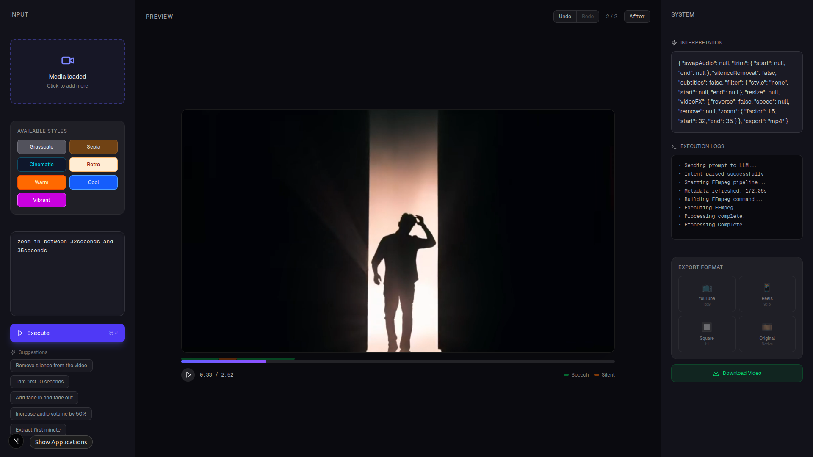

# 🎬 AntiEditor

> **"Edit videos by talking to them."**



AntiEditor is an AI-powered, prompt-based non-linear video editor. Instead of fiddling with complex timelines, keyframes, and layers, you simply describe what you want, and the engine handles the rest.

Built with **Next.js 15**, **Node.js**, **FFmpeg**, and **LLMs** (OpenAI/Gemini).

---

## ✨ Key Features

### 🗣️ Natural Language Editing
Just type what you want to see. The engine interprets your intent and constructs complex FFmpeg pipelines automatically.
- *"Remove the silent parts and speed up the rest."*
- *"Make the last 5 seconds slow motion."*

### ⚡ Smart Speed Control
Change the playback speed of specific segments while keeping audio in sync (or muting it for extreme speeds).
- **Speed Up**: "Fast forward from 10s to 20s by 2x"
- **Slow Motion**: "Slow down the first 5 seconds"

### ✂️ Precision Editing
- **Remove Segments**: "Remove between 1:00 and 1:30"
- **Zoom / Crop**: "Zoom in on the video from 10s to 15s" (Digital Punch-in)
- **Trim**: "Keep only the first minute"

### 🎨 AI Color Grading
Apply professional color filters to the entire video or specific time ranges.
- **Styles**: `Cinematic`, `Vintage`, `Sepia`, `Grayscale`, `Warm`, `Cool`, `Vibrant`.
- *Example*: "Make it cinematic from 10s to 20s"

### 📤 Smart Export
Select your target platform, and AntiEditor automatically resizes, crops, or pads your video.
- **YouTube (16:9)**: Smart padding/letterboxing.
- **Reels/TikTok (9:16)**: Center crop & scale.
- **Square (1:1)**: Perfect for Instagram posts.
- **Original**: Keeps the native resolution.

### 🧹 Auto-Cleanup
- The system automatically cleans up temporary files (uploads and intermediate outputs) every time you restart the session, keeping your disk usage low.

---

## 🏗️ Architecture

The project consists of two main parts:

1.  **Frontend (`/`)**: A modern **Next.js 15** application with a sleek, dark-mode UI, providing real-time feedback, video preview, and an "Export" card for quick formatting.
2.  **Backend (`/backend`)**: A robust **Node.js/Express** service that handles:
    - **Intent Parsing**: Converting natural language into structured JSON commands (using LLMs or Regex heuristics).
    - **FFmpeg Builder**: Dynamically constructing complex `filter_complex` chains for FFmpeg.
    - **Execution**: Managing the FFmpeg process and streaming progress back to the UI.

---

## 🚀 Getting Started

### Prerequisites

- **Node.js** (v18 or higher)
- **FFmpeg** (Must be installed and accessible in your system PATH)
  - *Mac*: `brew install ffmpeg`
  - *Linux*: `sudo apt install ffmpeg`
  - *Windows*: [Download & Add to PATH](https://ffmpeg.org/download.html)

### 1. Clone the Repository

```bash
git clone https://github.com/yourusername/antieditor.git
cd antieditor
```

### 2. Setup Backend

```bash
cd backend
npm install
```

**Configuration (.env)**:
Create a `.env` file in the `backend/` directory:

```env
PORT=3002
# Optional: Add your API Key for full AI power.
# If omitted, the system falls back to "Mock Mode" (Keyword Matching) which supports all major features locally!
LLM_PROVIDER=openai # or 'gemini'
LLM_API_KEY=sk-proj-...
```

### 3. Setup Frontend

Return to the root directory:

```bash
cd ..
npm install
```

---

## 🏃‍♂️ Running the App

You need to run both the backend and frontend servers.

**Terminal 1 (Backend):**
```bash
cd backend
npm run dev
# Server running on http://localhost:3002
```

**Terminal 2 (Frontend):**
```bash
npm run dev
# App running on http://localhost:3001
```

Open **[http://localhost:3001](http://localhost:3001)** in your browser to start editing!

---

## 📖 Usage Guide

1.  **Upload**: Drag and drop a video file into the "Input" zone.
2.  **Select Format**: (Optional) Click a format button in the "System" panel (e.g., "Reels", "Original") to force a specific output aspect ratio.
3.  **Prompt**: Type your command in the chat box.
    - *"Zoom in from 5s to 10s"*
    - *"Make it cinematic and export for Reels"*
4.  **Process**: The system will analyze your intent, generate an FFmpeg command, and render the video.
5.  **Download**: Once processing is complete, click the green **"Download Video"** button to save the result.

---

## 🤝 Contributing

Contributions are welcome! Please feel free to submit a Pull Request.

1.  Fork the Project
2.  Create your Feature Branch (`git checkout -b feature/AmazingFeature`)
3.  Commit your Changes (`git commit -m 'Add some AmazingFeature'`)
4.  Push to the Branch (`git push origin feature/AmazingFeature`)
5.  Open a Pull Request

---

## 📄 License

Distributed under the MIT License. See `LICENSE` for more information.
